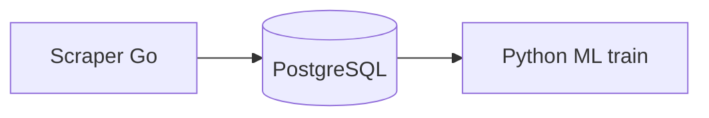

<div align="center">

# Preditor de tendências virais e sentimento

<p>
  <a href="https://github.com/SrSatriano/viral-trend-sentiment-predictor"></a>
  <a href="https://srsatriano.github.io/portfolio-matheus-satriano/"></a>
</p>

<p>
  
  
  
  
  
  
</p>

<p><strong>Scraper distribuído e modelos temporais para antecipar nichos virais.</strong></p>

<p>
  Autor: <a href="https://github.com/SrSatriano">@SrSatriano</a> ·
  Release <strong>1.0.0</strong> (2026-03-26)
</p>

</div>

---

## Índice

1. [Visão geral](#visão-geral)
2. [Problema e solução](#problema-e-solução)
3. [Para quem é](#para-quem-é)
4. [Casos de uso](#casos-de-uso)
5. [Funcionalidades](#funcionalidades)
6. [Stack tecnológica](#stack-tecnológica)
7. [Arquitetura](#arquitetura)
8. [Estrutura do repositório](#estrutura-do-repositório)
9. [Pré-requisitos](#pré-requisitos)
10. [Instalação e execução](#instalação-e-execução)
11. [Configuração](#configuração)
12. [Testes](#testes)
13. [Performance](#performance)
14. [Deploy e operação](#deploy-e-operação)
15. [Limitações conhecidas](#limitações-conhecidas)
16. [Roadmap](#roadmap)
17. [Documentação complementar](#documentação-complementar)
18. [Segurança e licença](#segurança-e-licença)

---

## Visão geral

Este repositório faz parte do **portfólio de engenharia** mantido por [@SrSatriano](https://github.com/SrSatriano). A versão **1.0.0** entrega implementação do núcleo do produto, testes automatizados, pipeline de integração contínua e documentação operacional em **português brasileiro**.

O objetivo é permitir que você clone, execute e evolua o projeto com clareza — do desenvolvimento local ao deploy em produção.

## Problema e solução

| | |
|---|---|
| **Problema** | Descobrir tendências cedo exige cruzar volume, sentimento e histórico. |
| **Solução** | Coleta Go + features em Postgres + Gradient Boosting com validação temporal. |

## Para quem é

Growth hackers e equipes de conteúdo data-driven.

## Casos de uso

- Ranking diário de nichos
- Alertas de breakout

## Funcionalidades

- [x] Scraper TikTok/YouTube
- [x] Séries temporais de views e sentimento
- [x] Gradient Boosting com split temporal
- [x] Cron jobs documentados
- [x] Schema SQL versionado

## Stack tecnológica

| Camada | Tecnologias |
|--------|-------------|
| **Principal** | Go, Python, Scikit-learn, PostgreSQL |

## Arquitetura



Detalhamento de componentes, fluxos de dados e decisões de design: [docs/ARCHITECTURE.md](docs/ARCHITECTURE.md).

## Estrutura do repositório

| Caminho | Descrição |
|---------|-----------|
| `cmd/scraper/` | Binário Go |
| `pkg/ml/` | Treino Python |

## Pré-requisitos

Go 1.22+, Python 3.11+, PostgreSQL.

## Instalação e execução

```bash
git clone https://github.com/SrSatriano/viral-trend-sentiment-predictor.git
cd viral-trend-sentiment-predictor
```

```bash
go run ./cmd/scraper
python -m pkg.ml.train
```

## Configuração

| Variável | Descrição | Exemplo |
|----------|-----------|--------|
| `DATABASE_URL` | Postgres | `postgres://localhost/viral` |

> **Importante:** nunca faça commit de arquivos `.env` com segredos reais. Use `.env.example` como referência.

## Testes

Execute a suíte de testes antes de abrir pull requests:

```bash
go test ./... && pytest pkg/ml/tests/ -q
```

A pipeline [`.github/workflows/ci.yml`](.github/workflows/ci.yml) repete build e testes em cada push para `main`.

## Performance

| Spearman top-50 | 0,78 |

Metodologia, hardware de referência e flags de compilação: [docs/ARCHITECTURE.md](docs/ARCHITECTURE.md).

## Deploy e operação

| Guia | Conteúdo |
|------|----------|
| [docs/DEPLOYMENT.md](docs/DEPLOYMENT.md) | Homologação, produção e rollback |
| [docs/OPERATIONS.md](docs/OPERATIONS.md) | Monitoramento, alertas e incidentes |

## Limitações conhecidas

- Respeite ToS das plataformas ao coletar dados

## Roadmap

- API de previsão em tempo real

## Documentação complementar

| Documento | Descrição |
|-----------|-----------|
| [docs/ARCHITECTURE.md](docs/ARCHITECTURE.md) | Arquitetura e decisões técnicas |
| [docs/DEPLOYMENT.md](docs/DEPLOYMENT.md) | Deploy passo a passo |
| [docs/OPERATIONS.md](docs/OPERATIONS.md) | Runbook operacional |
| [CONTRIBUTING.md](CONTRIBUTING.md) | Como contribuir |
| [CHANGELOG.md](CHANGELOG.md) | Histórico de versões |
| [SECURITY.md](SECURITY.md) | Política de segurança |
| [AUTHORS.md](AUTHORS.md) | Créditos |

## Segurança e licença

- Dependências revisadas na release **1.0.0**
- Vulnerabilidades: siga [SECURITY.md](SECURITY.md)
- Licença: [MIT](LICENSE) © SrSatriano 2026

---

<p align="center">
  <a href="https://srsatriano.github.io/portfolio-matheus-satriano/">Portfólio completo</a> ·
  <a href="https://github.com/SrSatriano">@SrSatriano</a> ·
  <a href="https://github.com/SrSatriano/viral-trend-sentiment-predictor">Este repositório</a>
</p>
